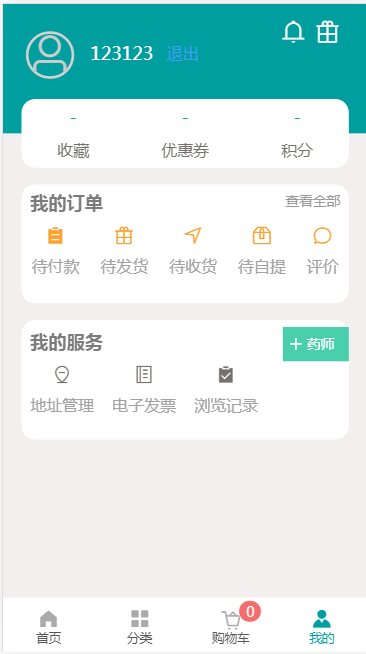
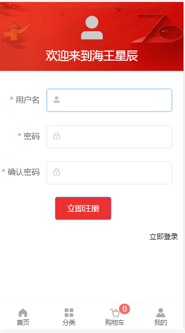
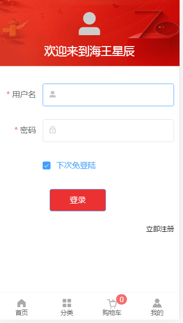

### 海王星辰商城
---

* 官网：https://xm.star365.com/
* 上线网址：http://119.23.107.32
* 后台网址：http://119.23.107.32：8080
* git仓库地址：https://github.com/gzh51907/hwxc.git

### 团队与分工
---

* 组长：秦慧云，成员：郑伯桂、陈东涛、汪云飞

* 负责模块说明
    * 秦慧云：分类页、后台模板和用户信息表
    * 郑伯桂：首页、公共页面、后台商品表
    * 陈东涛：详情页、购物车、后台添加新用户表
    * 汪云飞：注册、登录、我的

### 项目图
---

* 首页
 

* 分类
 

* 购物车
 

* 我的
 

* 注册
 

* 登录
 

## 技术栈

### 前端
* Vue
* Vue-Router
* Vuex
* Vue-Cli
* axios
* elementUI
* git

### 后端
* Nodejs
* Express
* MongoDB
* elementUI
* layui

### 项目目录
---

|-- undefined

    |-- .gitignore

    |-- babel.config.js

    |-- package-lock.json

    |-- package.json

    |-- README.md

    |-- vue.config.js

    |-- public

    |   |-- favicon.ico

    |   |-- index.html

    |-- src(项目内容)

        |-- App.vue

        |-- main.js

        |-- assets

        |   |-- logo.png

        |-- components

        |   |-- HelloWorld.vue

        |-- css(引入base样式))

        |   |-- base.css

        |-- images(图片)

        |   |-- active.png

        |   |-- img1.png

        |   |-- jiantou.png

        |   |-- lightning.png

        |   |-- loading.png

        |   |-- logo.png

        |   |-- logo_1.png

        |   |-- logo_2.png

        |   |-- logo_3.png

        |   |-- logo_4.png

        |   |-- no-goods.png

        |   |-- qiye.png

        |   |-- quanguo.png

        |   |-- tl.png

        |   |-- zhengpin.png

        |-- pages(各个单页面)

        |   |-- Cart.vue

        |   |-- Footer.vue

        |   |-- Goods.vue

        |   |-- Header.vue

        |   |-- Home.vue

        |   |-- Login.vue

        |   |-- Mine.vue

        |   |-- NotFound.vue

        |   |-- Reg.vue

        |   |-- Sort.vue

        |-- router(路由)

        |   |-- index.js

        |-- store(vuex模块化)

            |-- cart.js

            |-- common.js

            |-- index.js
